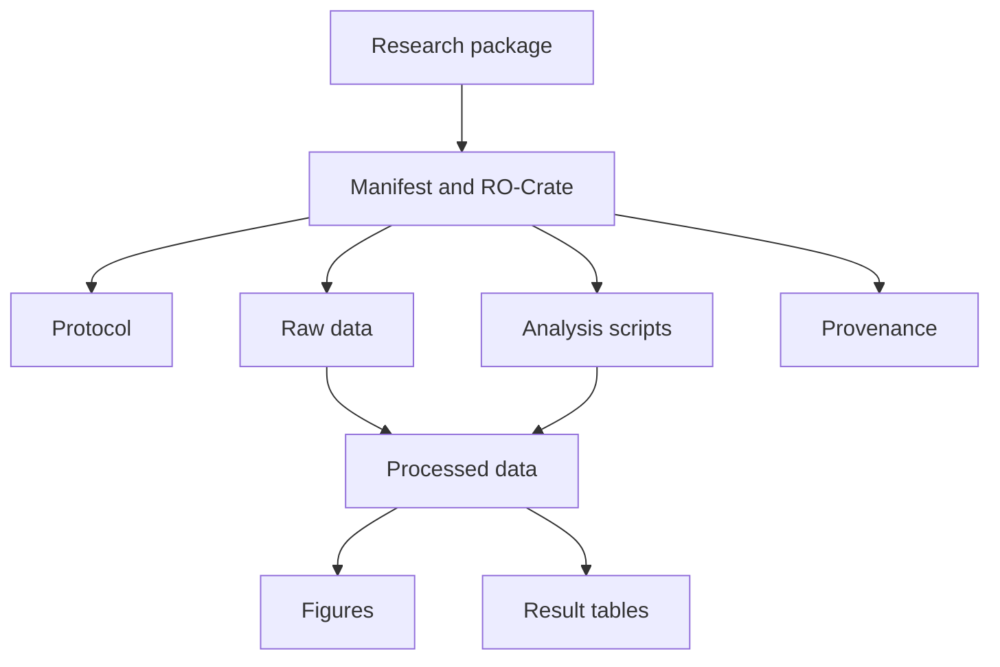

# Package Structure

```mermaid
flowchart TD
    A[Research package] --> M[Manifest and RO-Crate]
    M --> P[Protocol]
    M --> R[Raw data]
    R --> D[Processed data]
    S[Analysis scripts] --> D
    D --> F[Figures]
    D --> T[Result tables]
    M --> V[Provenance]
    M --> S
```
